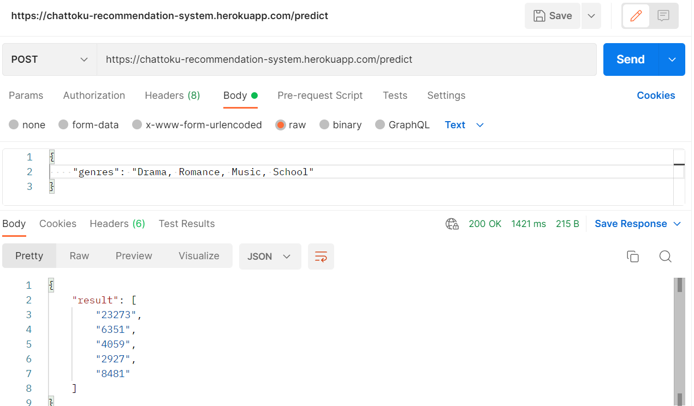

# Chattoku-Recommendation-System
This is the repository for the recommendation system used in [Chattoku](https://github.com/sugiyem/Chattoku).  

To use this system, simply send a post request to https://chattoku-recommendation-system.herokuapp.com/predict  

The message body of the post request must be a string of anime genres. 
(Genre, Theme, and Demographic listed in [here](https://myanimelist.net/anime/genre/info) are all considered as genre in this system)  

After sending a valid request, this system will return 5 MyAnimeList ID of the recommended animes.
See screenshot below for example

  

